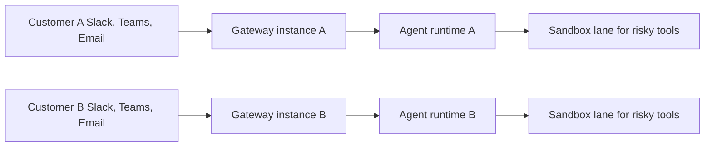

# OpenClaw

<p align="center">
    
    
</p>

<p align="center">
  <strong>B2B AI gateway with one isolated instance per customer.</strong><br />
  V1 integrations are curated: Slack, Microsoft Teams, and email webhook ingress.
</p>

<Columns>
  <Card title="Deploy a customer instance" href="/start/openclaw" icon="building-2">
    Set up an isolated Gateway, workspace, and auth profile for one customer.
  </Card>
  <Card title="Run the wizard" href="/start/wizard" icon="sparkles">
    Use `openclaw onboard` to configure gateway, integrations, and safety policy.
  </Card>
  <Card title="Review channel scope" href="/channels" icon="network">
    See the v1 channel surface and integration requirements.
  </Card>
</Columns>

## What OpenClaw is for

OpenClaw is a self-hosted control plane for enterprise AI assistants. Instead of one shared multi-tenant service, you run one OpenClaw instance per customer environment.

This model gives you:

- Customer-level isolation for sessions, credentials, and routing.
- Curated integrations with controlled rollout and support boundaries.
- A clear safety boundary where risky tool execution stays in a sandbox lane.
- Operator control through CLI and Web Control UI.

## V1 integration scope

- [Slack](/channels/slack)
- [Microsoft Teams](/channels/msteams)
- [Email webhook ingress](/automation/webhook)

Additional integrations can be enabled later through curated extension work, not by default in v1.

## How it works



Each customer instance owns its own policies, credentials, and routing state.

## Key capabilities

<Columns>
  <Card title="Single-tenant by default" icon="shield-check">
    One customer per Gateway instance with isolated session and config state.
  </Card>
  <Card title="Curated integrations" icon="plug">
    Controlled v1 channel scope: Slack, Microsoft Teams, and email webhook ingress.
  </Card>
  <Card title="Sandbox lane" icon="container">
    Route risky tools to sandboxed execution instead of host execution.
  </Card>
  <Card title="Control UI" icon="monitor">
    Browser interface for chat, diagnostics, configuration, and sessions.
  </Card>
  <Card title="Operational controls" icon="wrench">
    Health checks, logs, and routing controls through CLI and gateway APIs.
  </Card>
  <Card title="Config-first rollout" icon="settings">
    Versionable config and repeatable onboarding across customer instances.
  </Card>
</Columns>

## Quick start

<Steps>
  <Step title="Install OpenClaw">
    ```bash
    npm install -g openclaw@latest
    ```
  </Step>
  <Step title="Run guided onboarding">
    ```bash
    openclaw onboard --install-daemon
    ```
  </Step>
  <Step title="Start the Gateway and open the dashboard">
    ```bash
    openclaw gateway --port 18789
    openclaw dashboard
    ```
  </Step>
</Steps>

Need full deployment details? Start with [Single-tenant setup](/start/openclaw).

## Start here

<Columns>
  <Card title="Single-tenant setup" href="/start/openclaw" icon="building-2">
    End-to-end setup guide for customer-isolated deployment.
  </Card>
  <Card title="Wizard reference" href="/start/wizard" icon="list-checks">
    Full onboarding flow and reconfiguration commands.
  </Card>
  <Card title="Gateway configuration" href="/gateway/configuration" icon="settings">
    Gateway auth, policy, and sandbox-related configuration.
  </Card>
  <Card title="Discovery and transports" href="/gateway/discovery" icon="radar">
    How clients discover and connect to customer instances.
  </Card>
  <Card title="Security" href="/gateway/security" icon="shield">
    Threat model, allowlists, and sandbox lane guidance.
  </Card>
  <Card title="Help" href="/help" icon="life-buoy">
    Troubleshooting and operational runbooks.
  </Card>
</Columns>
