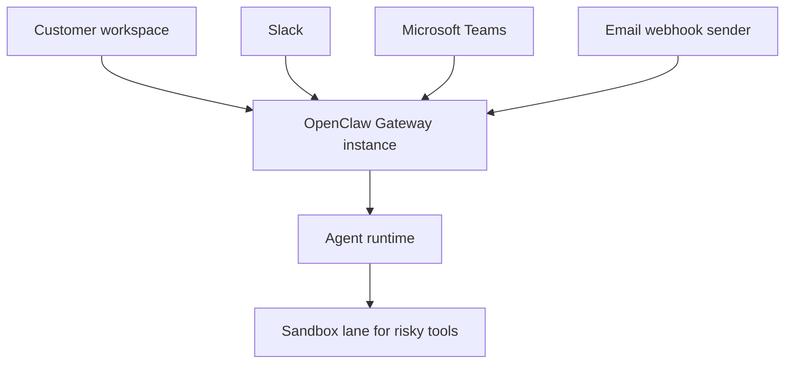

# Single-tenant customer setup

This guide describes the B2B deployment model: one OpenClaw Gateway instance per customer. Each instance gets dedicated credentials, routing, policy, and workspace state.

V1 integration scope is curated:

- [Slack](/channels/slack)
- [Microsoft Teams](/channels/msteams)
- [Email webhook ingress](/automation/webhook)

## Safety baseline

Treat all inbound messages and webhook payloads as untrusted input.

Start with these defaults:

- Keep each customer on its own Gateway instance.
- Scope credentials per customer integration, never shared across customers.
- Route risky tool calls to a sandbox lane only.
- Keep explicit sender/channel allowlists where applicable.

Example sandbox-lane baseline:

```json5
{
  agents: {
    defaults: {
      sandbox: {
        mode: "non-main",
      },
    },
  },
}
```

In this model, non-main sessions run in sandboxed environments, which is the recommended lane for risky tools.

## Prerequisites

- OpenClaw installed (`Node 22+`)
- A deployment target for the customer instance (local host or dedicated VM)
- Integration credentials for Slack and/or Microsoft Teams
- A webhook sender for email events if you use email ingress

## Target topology



## 10-minute bootstrap

1. Run onboarding:

```bash
openclaw onboard --install-daemon
```

2. Start the gateway:

```bash
openclaw gateway --port 18789
```

3. Open the dashboard:

```bash
openclaw dashboard
```

4. Connect curated integrations:

- Slack: [Slack setup](/channels/slack)
- Microsoft Teams: [Microsoft Teams setup](/channels/msteams)
- Email webhook: [Webhook setup](/automation/webhook)

## Recommended config shape

Use one config file per customer instance (`~/.openclaw/openclaw.json`) and commit a sanitized template to version control.

```json5
{
  gateway: {
    bind: "loopback",
  },
  channels: {
    slack: {
      botToken: "env:SLACK_BOT_TOKEN",
      appToken: "env:SLACK_APP_TOKEN",
    },
  },
  agents: {
    defaults: {
      sandbox: {
        mode: "non-main",
      },
    },
  },
}
```

Use separate env files and secrets for each customer deployment.

## Operations checklist

```bash
openclaw status
openclaw status --all
openclaw status --deep
openclaw health --json
```

## Next steps

- Wizard details: [Onboarding wizard](/start/wizard)
- Channel scope: [Chat channels](/channels)
- Discovery and remote access: [Discovery and transports](/gateway/discovery)
- Policy and hardening: [Security](/gateway/security)
